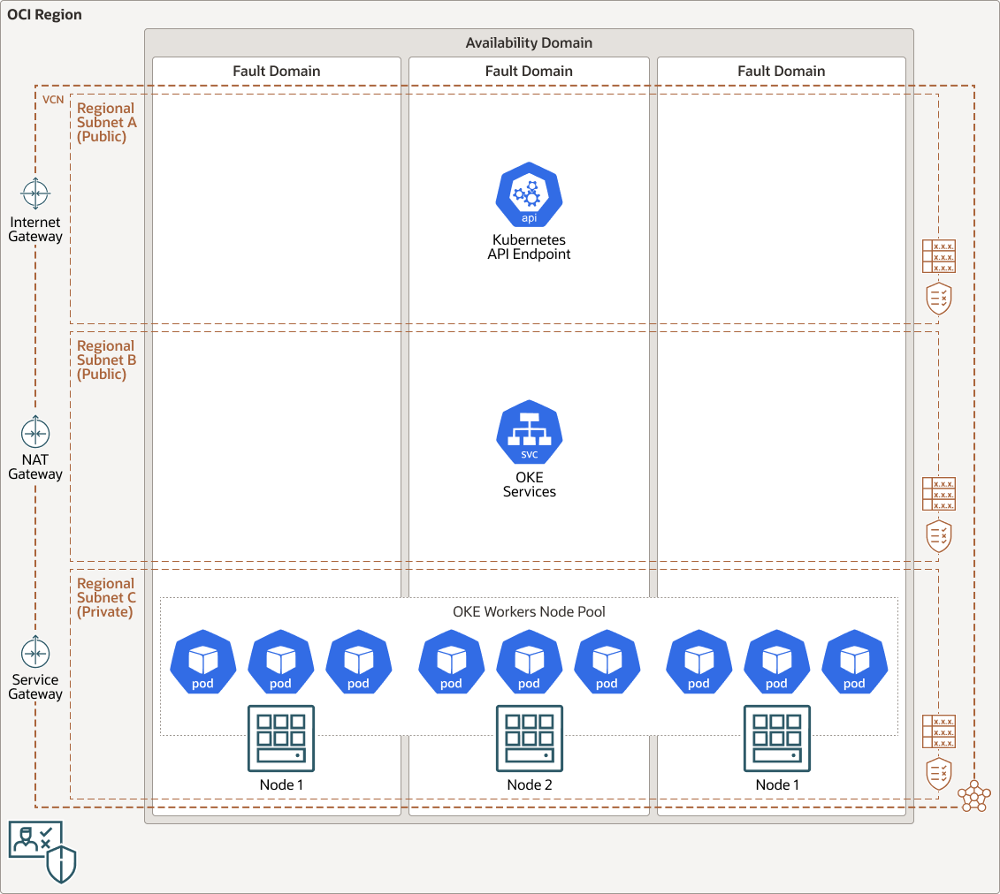

# terraform-oci-arch-oke-autoscale-gitlab-runners

Deploy GitLab Runners on Oracle Container Engine for Kubernetes with autoscaling functionality to scale worker nodes automatically based on load for smooth running jobs in the CI/CD pipeline. This Terraform code will create an OKE cluster with all dependent resources (networking, worker node-pool), deploy cluster autoscalling and Gitlab runners. 

For details of the architecture, see [_Deploy GitLab Runners on Oracle Container Engine for Kubernetes with autoscaling_](https://docs.oracle.com/en/solutions/git-lab-runners-on-oke/index.html)





OKE cluster autoscaling is based on deployments resource booking. When booked resources exceed available resources (CPU, memory) on worker nodes, new worker nodes are added automatically to the cluster up to `max_number_of_nodes:10`. When cluster resources are not utilized, number of worker nodes will be decresed down to `min_number_of_nodes:3`.

Gitlab runners will handle pending CI/CD jobs and will book, by default, 0.2 CPU and 512M RAM. These values can be overriden using `KUBERNETES_CPU_REQUEST` and `KUBERNETES_MEMORY_REQUEST` variables. Default values can be modified in `locals.tf`.

## Prerequisites

1. OCI account with rights to:
    - manage dynamic groups
    - manage policies
    - manage network resources
    - manage OKE clusters
    - manage compute resources
    - manage resource manager service

    **Note:** 

    - If you don't have access to an OCI tenancy you can register [here](https://www.oracle.com/cloud/free/) for a free trial.
    
    - In case you plan to use existing OCI network resources, make sure [these](https://docs.oracle.com/en-us/iaas/Content/ContEng/Concepts/contengnetworkconfig.htm#securitylistconfig) requirements are met.

2. Gitlab account.
   - required for Gitlab Runner registration token

If you don't have the required permissions and quota, contact your tenancy administrator. See [Policy Reference](https://docs.cloud.oracle.com/en-us/iaas/Content/Identity/Reference/policyreference.htm), [Service Limits](https://docs.cloud.oracle.com/en-us/iaas/Content/General/Concepts/servicelimits.htm), [Compartment Quotas](https://docs.cloud.oracle.com/iaas/Content/General/Concepts/resourcequotas.htm).

## Deploy Using Oracle Resource Manager

1. Click [](https://cloud.oracle.com/resourcemanager/stacks/create?region=home&zipUrl=https://github.com/oracle-devrel/terraform-oci-arch-oke-autoscale-gitlab-runners/releases/latest/download/terraform-oci-arch-oke-autoscale-gitlab-runners-stack-latest.zip)

    If you aren't already signed in, when prompted, enter the tenancy and user credentials.

2. Review and accept the terms and conditions.

3. Select the region where you want to deploy the stack.

4. Follow the on-screen prompts and instructions to create the stack.

5. After creating the stack, click **Terraform Actions**, and select **Plan**.

6. Wait for the job to be completed, and review the plan.

    To make any changes, return to the Stack Details page, click **Edit Stack**, and make the required changes. Then, run the **Plan** action again.

7. If no further changes are necessary, return to the Stack Details page, click **Terraform Actions**, and select **Apply**. 

## Deploy Using the Terraform CLI

### Clone the Module

Now, you'll want a local copy of this repo. You can make that with the commands:

```
    git clone https://github.com/oracle-devrel/terraform-oci-arch-oke-autoscale-gitlab-runners.git
    cd terraform-oci-arch-oke-autoscale-gitlab-runners
    ls
```

### Prerequisites
First off, you'll need to do some pre-deploy setup.  That's all detailed [here](https://github.com/cloud-partners/oci-prerequisites).

Create a `terraform.tfvars` file, and specify the following variables:

```
# Authentication
tenancy_ocid         = "<tenancy_ocid>"
user_ocid            = "<user_ocid>"
fingerprint          = "<finger_print>"
private_key_path     = "<pem_private_key_path>"

# Region
region = "<oci_region>"

# Compartment
compartment_ocid = "<compartment_ocid>"

````

### Create the Resources
Run the following commands:

    terraform init
    terraform plan
    terraform apply


### Check status of the deployment

Connect to OCI cloud shell and execute below commands:

    $ oci ce cluster create-kubeconfig --cluster-id <oke_cluster_id>
    $ kubectl get deployments --all-namespaces

Confirm deployed gitlab runners are available in runners section of Gitlab Project CI/CD Settings.

Validate the deployment using `gitlab-ci.yml` file in `samples` directory.

### Destroy the Deployment
When you no longer need the deployment, you can run this command to destroy the resources:

    terraform destroy

## Contributing
This project is open source.  Please submit your contributions by forking this repository and submitting a pull request!  Oracle appreciates any contributions that are made by the open source community.

## License
Copyright (c) 2021 Oracle and/or its affiliates.

Licensed under the Universal Permissive License (UPL), Version 1.0.

See [LICENSE](LICENSE) for more details.

